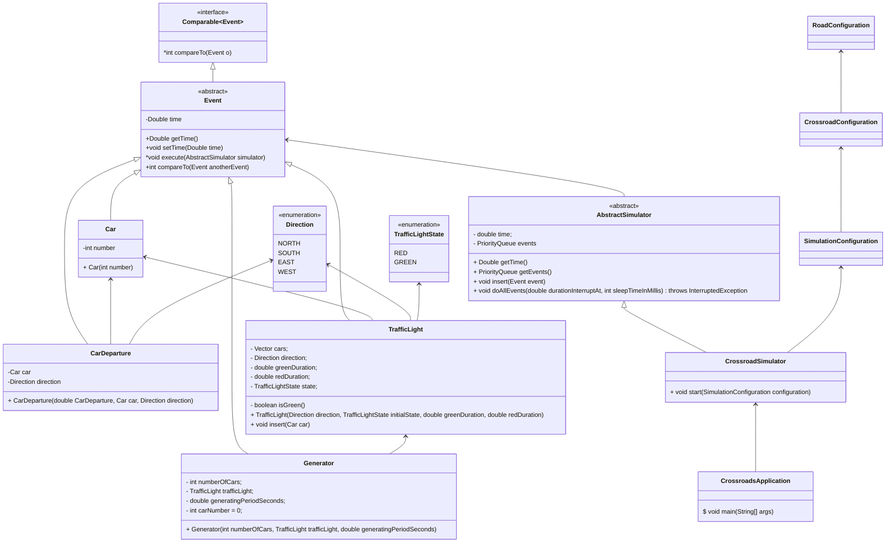

# Simple simulation of a crossroad

Application is representing a simple crossroad simulation based on a time loop and events.

Simulator is composed of "infinity" time loop, which is located in the simulator business logic itself. This infinity
loop is polling events from priority queue. Sorting in the queue is based on "time". Time is the double number, which in
simulator represented as a unit of virtual seconds.

In implementation are 3 full "events" and the car event :)

* **Car** is not the true event. Although implements Event abstract class, car is never planed into the time loop.
* **Generator** is event, whose responsibility is generating the cars.
* **TrafficLight** is event representing a traffic light color switch on timeline.
* **CarDeparture** is implementation of car departure process from the traffic light.

### Crossroad simulator

The Simulator is base on composition of elementary problems and plan them on the timeline.

Simulator is composed of the "crossroad directions". For every direction is inside generator and traffic light. So every
direction is processed independently.

The main time loop of the simulator polls events from the timeline and executed theirs business logic.

More details about the algorithm are in the code comments.

### Main Events

#### Generator

Generating of cars is very simple process. Is generated X cars for every 60 seconds. Inside every new car event is
filled value of generation time + incremental delta.

After generating of cars is done, the Generator is re-plan on the timeline for the next execution.

#### Traffic Light

The TrafficLight event is the main business logic unit. Represents a traffic light switch, but contains also queue of
waiting cars.

When is event on the timeline executed, is started processing of cars located in traffic light queue. This process is
based on some rules, which are described in code.

After car processing is done, the TrafficLight is re-plan on the timeline for the next execution of traffic light
switch.

## Class diagram

## Algorithm problem

Due to used algorithm of simulation is there one significant problem. Problem is timing of generating of Cars. If is
used timing, which is not in sync with switching of traffic light, some cars will be "waiting" on green color of traffic
light.

## Ideas for improving

* In implemented case are used 4 different instances of traffic light. It is not necessary. If we know the structure and
  the crossroad traffic flow, we can use only one a traffic light. Because if in two directions is shining green, in the
  other two directions is traffic light red etc...
* Algorithm may be improved from the "batching" generating of cars to the "stream/event" type. We should plan generator
  event often than now. If traffic light is green, generated cars are immediately passed to the departure. If the
  traffic light is shining red, cars are saved into the vector...